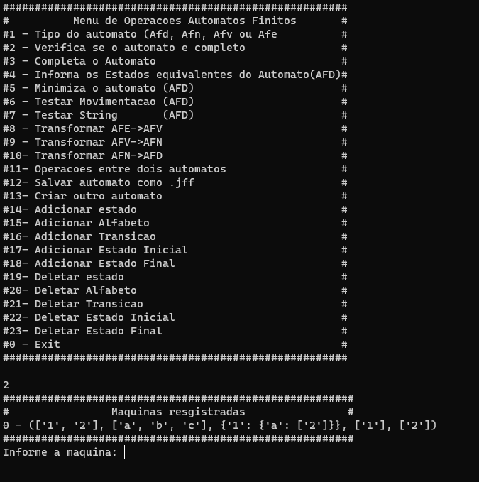

Trabalho LFA  
================

### Descrição
Trabalho requerido pela disciplina de LFA, no qual deve-se fazer um programa para ler e criar automatos no estilo JFLAP7. Além disso, deve-se fazer as operações nesses autômatos, ou seja, algoritmo de redução, transformar AFN em AFD, etc.


Table of contents
=================
<!--ts-->
   * [Descrição](#Descrição)
   * [Table of contents](#tabela-de-conteudo)
   * [Usage](#Usage)
      * [Prerequisites](#prerequisites)
      * [Local Files](#local-files)
      * [Experimento](#experimento)
      * [Final](#final)
<!--te-->

# Usage

## Pré-requisitos

Somente é necessário ter instalado o python3.6 na sua máquina

## Experimento
1. Para executar (coloque o terminal em tela cheia): 
```
$ python3 main.py
```

2. Informe o diretório  do autômato em JFLAP7:

3. Escolha a operação

## Final



